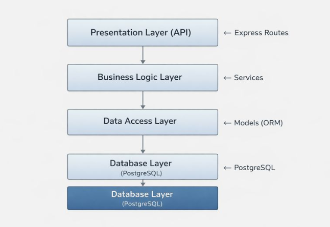
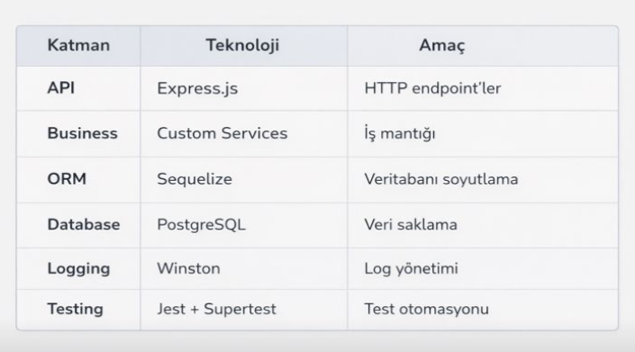
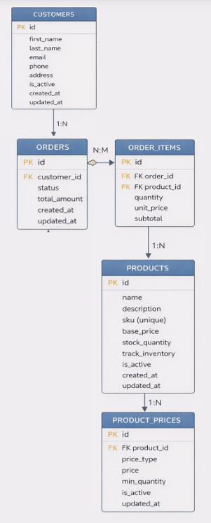
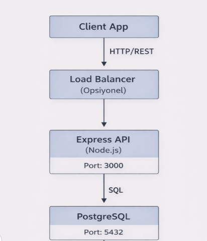

# Mimari Tasarım Dokümanı


---

## 1. Sistem Mimarisi Genel Bakış

### 1.1 Mimari Stil
**Katmanlı Mimari (Layered Architecture)**

```

```

### 1.2 Teknoloji Stack



---

## 2. Veritabanı Şeması

### 2.1 Entity Relationship Diagram (ERD)



### 2.2 Tablo Açıklamaları

#### **customers** (Müşteriler)
Sistem kullanıcılarını/müşterilerini saklar.

| Kolon | Tip | Özellik | Açıklama |
|-------|-----|---------|----------|
| id | INTEGER | PK, AUTO | Birincil anahtar |
| first_name | VARCHAR | NOT NULL | Ad (zorunlu) |
| last_name | VARCHAR | NULL | Soyad (opsiyonel) |
| email | VARCHAR | NULL | Email (opsiyonel) |
| phone | VARCHAR | NULL | Telefon (opsiyonel) |
| address | TEXT | NULL | Adres bilgisi |
| is_active | BOOLEAN | DEFAULT true | Soft delete için |
| created_at | TIMESTAMP | - | Kayıt tarihi |
| updated_at | TIMESTAMP | - | Güncelleme tarihi |

**Not:** Email veya phone'dan en az biri olmalı (iş kuralı).

---

#### **products** (Ürünler)
Satışa sunulan ürünleri saklar.

| Kolon | Tip | Özellik | Açıklama |
|-------|-----|---------|----------|
| id | INTEGER | PK, AUTO | Birincil anahtar |
| name | VARCHAR | NOT NULL | Ürün adı |
| description | TEXT | NULL | Ürün açıklaması |
| sku | VARCHAR | UNIQUE | Stok kodu |
| base_price | DECIMAL(10,2) | NOT NULL | Temel fiyat |
| stock_quantity | INTEGER | DEFAULT 0 | Stok miktarı |
| track_inventory | BOOLEAN | DEFAULT true | Stok takibi yapılsın mı? |
| is_active | BOOLEAN | DEFAULT true | Soft delete |
| created_at | TIMESTAMP | - | Kayıt tarihi |
| updated_at | TIMESTAMP | - | Güncelleme tarihi |

**İndexler:**
- `idx_products_name` ON name
- `idx_products_sku` ON sku
- `idx_products_is_active` ON is_active

---

#### **product_prices** (Ürün Fiyatları)
Ürünlerin farklı fiyat tiplerini saklar (toptan, perakende, vb.).

| Kolon | Tip | Özellik | Açıklama |
|-------|-----|---------|----------|
| id | INTEGER | PK, AUTO | Birincil anahtar |
| product_id | INTEGER | FK → products | Hangi ürün |
| price_type | VARCHAR | - | Fiyat tipi (wholesale, retail, bulk) |
| price | DECIMAL(10,2) | NOT NULL | Fiyat |
| min_quantity | INTEGER | DEFAULT 1 | Minimum miktar |
| is_active | BOOLEAN | DEFAULT true | Aktif mi? |
| created_at | TIMESTAMP | - | Kayıt tarihi |
| updated_at | TIMESTAMP | - | Güncelleme tarihi |

**Foreign Keys:**
- `product_id` → `products.id` (CASCADE)

---

#### **orders** (Siparişler)
Müşteri siparişlerini saklar.

| Kolon | Tip | Özellik | Açıklama |
|-------|-----|---------|----------|
| id | INTEGER | PK, AUTO | Birincil anahtar |
| customer_id | INTEGER | FK → customers | Hangi müşteri |
| status | VARCHAR | DEFAULT 'pending' | Sipariş durumu |
| total_amount | DECIMAL(10,2) | NOT NULL | Toplam tutar |
| created_at | TIMESTAMP | - | Sipariş tarihi |
| updated_at | TIMESTAMP | - | Güncelleme tarihi |

**Geçerli Durumlar:**
- `pending` - Beklemede
- `preparing` - Hazırlanıyor
- `shipped` - Kargoda
- `delivered` - Teslim edildi
- `cancelled` - İptal edildi
- `backordered` - Ön sipariş

**Foreign Keys:**
- `customer_id` → `customers.id` (CASCADE)

---

#### **order_items** (Sipariş Kalemleri)
Siparişlerdeki ürün detaylarını saklar.

| Kolon | Tip | Özellik | Açıklama |
|-------|-----|---------|----------|
| id | INTEGER | PK, AUTO | Birincil anahtar |
| order_id | INTEGER | FK → orders | Hangi sipariş |
| product_id | INTEGER | FK → products | Hangi ürün |
| quantity | INTEGER | NOT NULL | Miktar |
| unit_price | DECIMAL(10,2) | NOT NULL | Birim fiyat |
| subtotal | DECIMAL(10,2) | NOT NULL | Ara toplam |
| created_at | TIMESTAMP | - | Kayıt tarihi |
| updated_at | TIMESTAMP | - | Güncelleme tarihi |

**Foreign Keys:**
- `order_id` → `orders.id` (CASCADE)
- `product_id` → `products.id` (RESTRICT)

---

## 3. Modüller ve Servisler

### 3.1 Katman Yapısı

```
src/
├── routes/          # API endpoint'leri tanımlar
│   ├── customers.js
│   ├── orders.js
│   └── products.js
│
├── services/        # İş mantığı
│   ├── customerService.js
│   ├── orderService.js
│   └── productService.js
│
├── models/          # Veritabanı modelleri
│   ├── customer.js
│   ├── order.js
│   ├── orderItem.js
│   ├── product.js
│   └── productPrice.js
│
├── middleware/      # Ara katman fonksiyonları
│   ├── errorHandler.js
│   └── requestLogger.js
│
├── utils/           # Yardımcı fonksiyonlar
│   └── validators.js
│
├── lib/             # Kütüphaneler
│   └── logger.js
│
└── config/          # Konfigürasyon
    ├── database.js
    └── index.js
```

---

### 3.2 Servis Açıklamaları

#### **customerService.js**
Müşteri yönetimi iş mantığı.

**Fonksiyonlar:**
- `listCustomers(options)` - Müşteri listesi (pagination)
- `getCustomerById(id)` - Tekil müşteri getir
- `createCustomer(data)` - Yeni müşteri oluştur
- `updateCustomer(id, data)` - Müşteri güncelle
- `deleteCustomer(id)` - Soft delete
- `findDuplicates(email, phone)` - Duplicate kontrolü

**İş Kuralları:**
- firstName zorunlu
- Email veya phone zorunlu
- Email format kontrolü
- Telefon normalize (→ +90...)
- İsim temizleme (sanitize)

---

#### **productService.js**
Ürün ve stok yönetimi.

**Fonksiyonlar:**
- `listProducts(options)` - Ürün listesi
- `getProductById(id)` - Tekil ürün
- `createProduct(data)` - Yeni ürün
- `updateProduct(id, data)` - Ürün güncelle
- `deleteProduct(id)` - Soft delete
- `updateStock(productId, quantity, operation)` - Stok güncelle
- `checkStock(productId, quantity)` - Stok kontrolü
- `addProductPrice(productId, priceData)` - Fiyat ekle
- `calculatePrice(productId, quantity)` - Fiyat hesapla

**İş Kuralları:**
- SKU unique olmalı
- track_inventory = false → sınırsız stok
- Fiyat hesaplamada miktar bazlı en uygun fiyat seçilir
- Stok negatif olamaz

---

#### **orderService.js**
Sipariş işlemleri ve stok entegrasyonu.

**Fonksiyonlar:**
- `listOrders(filters)` - Sipariş listesi
- `getOrderById(id)` - Sipariş detayı
- `createOrder(payload)` - Yeni sipariş (guest destekli)
- `updateOrder(id, data)` - Sipariş güncelle
- `updateOrderStatus(id, status)` - Durum güncelle

**İş Kuralları:**
- customerId yoksa guest müşteri oluştur
- Ürün varsa stok kontrolü yap
- Stok yetersizse → status = 'backordered'
- Stoktan otomatik düşüm
- Fiyat otomatik hesaplama

---

## 4. API Endpoint'leri Listesi

### 4.1 Müşteri API

| Method | Endpoint | Açıklama | Body |
|--------|----------|----------|------|
| GET | `/api/customers` | Müşteri listesi | - |
| GET | `/api/customers/:id` | Müşteri detayı | - |
| POST | `/api/customers` | Yeni müşteri | Customer object |
| PUT | `/api/customers/:id` | Müşteri güncelle | Customer object |
| DELETE | `/api/customers/:id` | Müşteri sil (soft) | - |

**Query Parameters (GET /api/customers):**
- `page` (number) - Sayfa numarası (default: 1)
- `limit` (number) - Sayfa başına kayıt (default: 50)
- `isActive` (boolean) - Sadece aktif müşteriler (default: true)

---

### 4.2 Ürün API

| Method | Endpoint | Açıklama | Body |
|--------|----------|----------|------|
| GET | `/api/products` | Ürün listesi | - |
| GET | `/api/products/:id` | Ürün detayı | - |
| POST | `/api/products` | Yeni ürün | Product object |
| PUT | `/api/products/:id` | Ürün güncelle | Product object |
| DELETE | `/api/products/:id` | Ürün sil (soft) | - |
| PATCH | `/api/products/:id/stock` | Stok güncelle | `{quantity, operation}` |
| GET | `/api/products/:id/check-stock` | Stok kontrolü | `?quantity=X` |
| POST | `/api/products/:id/prices` | Fiyat ekle | Price object |
| GET | `/api/products/:id/calculate-price` | Fiyat hesapla | `?quantity=X` |

---

### 4.3 Sipariş API

| Method | Endpoint | Açıklama | Body |
|--------|----------|----------|------|
| GET | `/api/orders` | Sipariş listesi | - |
| GET | `/api/orders/:id` | Sipariş detayı | - |
| POST | `/api/orders` | Yeni sipariş | Order object |
| PUT | `/api/orders/:id` | Sipariş güncelle | Order object |
| PATCH | `/api/orders/:id/status` | Durum güncelle | `{status}` |

**Query Parameters (GET /api/orders):**
- `status` (string) - Duruma göre filtrele
- `customerId` (number) - Müşteriye göre filtrele
- `page` (number) - Sayfa
- `limit` (number) - Limit

---

### 4.4 API Response Format

**Başarılı Response:**
```json
{
  "success": true,
  "data": { ... }
}
```

**Hatalı Response:**
```json
{
  "success": false,
  "error": {
    "message": "Hata mesajı",
    "field": "hatali_alan",
    "code": "VALIDATION_ERROR"
  }
}
```

---

## 5. Logging Yapısı

### 5.1 Winston Logger

**Konfigürasyon:**
```javascript
const logger = createLogger({
  level: config.logging.level,      // Ortama göre
  format: isDevelopment ? 
    developmentFormat :               // Renkli, okunabilir
    productionFormat,                 // JSON
  transports: [
    new transports.Console(),
    new transports.File({ 
      filename: 'combined.log',
      maxsize: 5242880,               // 5MB
      maxFiles: 5                     // Rotasyon
    }),
    new transports.File({ 
      filename: 'error.log',
      level: 'error' 
    })
  ]
});
```

**Log Seviyeleri:**
- `error` - Kritik hatalar
- `warn` - Uyarılar
- `info` - Bilgilendirme
- `debug` - Detaylı bilgi (sadece development)

**Örnek Kullanım:**
```javascript
logger.info('Customer created', { 
  customerId, 
  traceId 
});

logger.error('Database connection failed', { 
  error: err.message,
  traceId 
});
```

---

## 6. Konfigürasyon Yapısı

### 6.1 Ortam Değişkenleri (.env)

```env
# Ortam
NODE_ENV=development

# Veritabanı
DB_HOST=localhost
DB_PORT=5432
DB_NAME=mini_crm_dev
DB_USER=postgres
DB_PASS=your_password

# Uygulama
APP_PORT=3000

# Loglama
LOG_LEVEL=debug
```

### 6.2 Ortam Bazlı Konfigürasyon

```javascript
// config/database.js
module.exports = {
  development: {
    database: 'mini_crm_dev',
    logging: console.log
  },
  test: {
    database: 'mini_crm_test',
    logging: false
  },
  production: {
    database: process.env.DB_NAME,
    logging: false,
    pool: { max: 20, min: 5 }
  }
};
```

---

## 7. Migration Yapısı

### 7.1 Migration Akışı

```
1. Migration Oluştur
   ↓
2. up() fonksiyonu → Değişikliği uygula
   ↓
3. down() fonksiyonu → Geri al
   ↓
4. Test et
   ↓
5. Uygula (migrate)
```

### 7.2 Migration Dosyaları

| Dosya | Açıklama |
|-------|----------|
| `20240101000000-create-customer.js` | Customers tablosu |
| `20240102000000-create-order.js` | Orders tablosu |
| `20260108060000-add-customer-isactive.js` | isActive kolonu ekle |
| `20260108070000-add-order-foreign-key.js` | Foreign key ekle |
| `20260111000000-create-products.js` | Products tablosu |
| `20260111000001-create-product-prices.js` | Product_prices tablosu |
| `20260111000002-create-order-items.js` | Order_items tablosu |

### 7.3 İdempotent Migration Örneği

```javascript
async up(queryInterface, Sequelize) {
  const tableDescription = await queryInterface
    .describeTable('customers');
  
  if (!tableDescription.is_active) {
    await queryInterface.addColumn('customers', 'is_active', {
      type: Sequelize.BOOLEAN,
      defaultValue: true
    });
    
    // Mevcut kayıtları güncelle
    await queryInterface.sequelize.query(
      'UPDATE customers SET is_active = true 
       WHERE is_active IS NULL'
    );
  }
}
```

**Özellikler:**
-  İdempotent (tekrar çalıştırılabilir)
-  Veri kaybı yok
-  Rollback destekli
-  Mevcut veri güvenli

---

## 8. Güvenlik ve En İyi Uygulamalar

### 8.1 Güvenlik

-  Şifreler environment variable'larda
-  SQL Injection → ORM kullanımı
-  Input validation → Tüm endpoint'ler
-  Error handling → Merkezi middleware
-  Logging → Trace ID ile takip

### 8.2 Performans

-  Pagination → Tüm listeleme endpoint'leri
-  Eager loading → N+1 problemi önlendi
-  Index'ler → Sık sorgulanan kolonlar
-  Connection pooling → Sequelize default

### 8.3 Kod Kalitesi

-  Service layer → İş mantığı ayrımı
-  Validation → Merkezi validator fonksiyonlar
-  Error handling → Tutarlı hata formatı
-  Logging → Yapılandırılmış loglar
-  Testing → 48 test case

---

## 9. Deployment Mimarisi



---

## 10. Sonuç

### Mimari Başarılar

✅ **Temiz Katmanlı Mimari**
- API, Service, Model katmanları ayrık
- SOLID prensipleri uygulandı
- Bakım yapılabilir kod

✅ **Ölçeklenebilir Veritabanı**
- Normal formlar (3NF)
- Optimize edilmiş index'ler
- Migration-based şema yönetimi

✅ **Production-Ready**
- Kapsamlı logging
- Merkezi konfigürasyon
- Test coverage

---

**Hazırlayan:** Öğrenci Ekibi  
**Versiyon:** 1.0  
**Tarih:** 11 Ocak 2026
